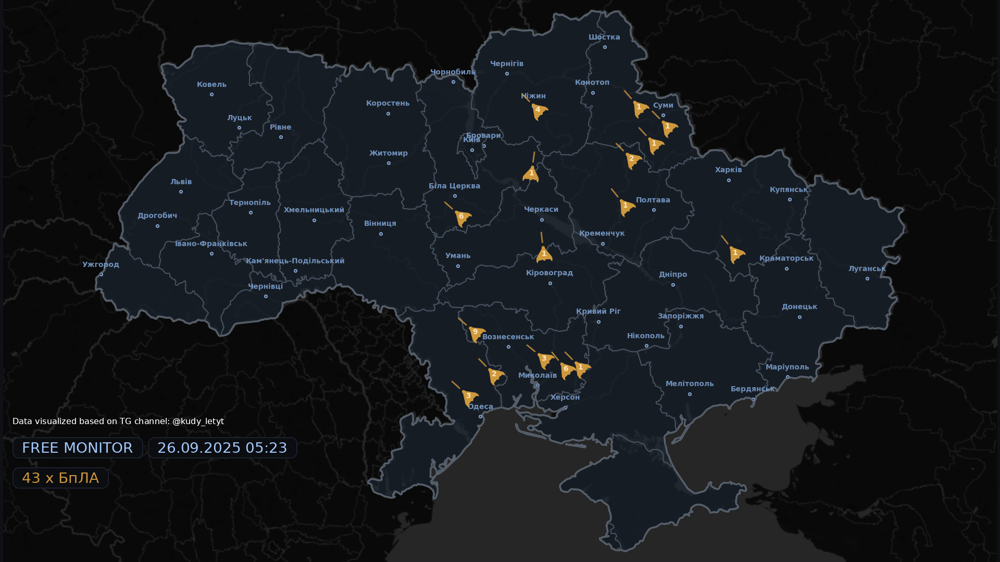
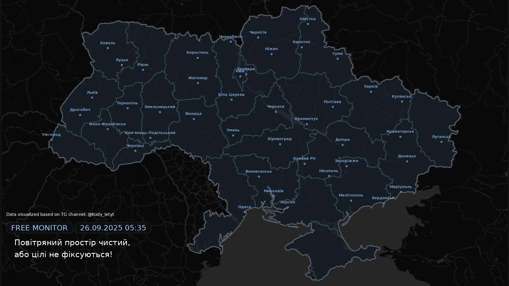

# 🗺️ FREE MONITOR

**Ukraine aerial threats monitoring system with automatic map visualization**  
**Система моніторингу повітряних загроз України з автоматичною візуалізацією на карті**

---

## 🌍 Language Selection / Вибір мови

### 🇺🇦 [Українська версія](readme/README_UA.md)
**Повна документація українською мовою**

### 🇬🇧 [English Version](readme/README_EN.md)  
**Complete documentation in English**

---

## 📋 Quick Overview / Короткий огляд

**EN:** Automated system for monitoring and visualizing aerial threats on Ukraine's map. Parses data from Telegram channels, processes it with AI, and generates real-time threat visualization maps.

**UA:** Автоматизована система моніторингу та візуалізації повітряних загроз на карті України. Парсить дані з Telegram каналів, обробляє за допомогою AI та генерує карти візуалізації загроз у реальному часі.

## 📸 Live Demo / Демонстрація

### Map with active threats / Карта з активними загрозами

### Clean airspace / Чистий повітряний простір  

## 🚀 Quick Start / Швидкий старт

### EN:
1. Choose your preferred documentation language above
2. Follow installation instructions  
3. Configure API keys
4. Run the code

### UA:
1. Оберіть бажану мову документації вище
2. Дотримуйтесь інструкцій встановлення
3. Налаштуйте API ключі  
4. Запустіть код

## ⚠️ Important / Важливо

**EN:** Currently adapted only for **[Rinda Monitoring](https://t.me/kudy_letyt)** channel. See documentation for adaptation to other channels.

**UA:** На поточному етапі адаптована лише для каналу **[Ринда моніторить](https://t.me/kudy_letyt)**. Дивіться документацію для адаптації під інші канали.

## 🔧 Core Technologies / Основні технології

- **Python 3.10+** - Core language / Основна мова
- **Google Gemini AI** - Text processing / Обробка тексту  
- **Pyrogram + TgCrypto** - Telegram API / API Telegram
- **GeoPandas** - Geographic data / Географічні дані
- **Pillow** - Visual elements / Візуальні елементи
- **Matplotlib** - Map visualization / Візуалізація карт
- **SQLite** - Local database / Локальна база даних

## 📊 Supported Weapons / Підтримувані типи зброї

| Type / Тип | Icon / Іконка | Description / Опис |
|-----------|---------------|-------------------|
| БпЛА / UAV | `uav.svg` | Shaheds / Шахеди |
| Х101 | `x101.svg` | Cruise missiles / Крилаті ракети |
| Ballistics / Балістика | `balistic.svg` | Ballistic missiles / Балістичні ракети |

## 🤝 Contributing / Участь у розробці

**EN:** Project is fully open source for non-commercial use. See detailed contributing guidelines in language-specific documentation.

**UA:** Проект повністю відкритий для некомерційного використання. Детальні вказівки щодо участі в розробці дивіться у мовній документації.

## ⚠️ Disclaimer / Застереження

**EN:** Created for information visualization based on open sources. Authors are not responsible for real-time data accuracy. Always use official threat information sources.

**UA:** Створено для візуалізації інформації на основі відкритих джерел. Автори не несуть відповідальності за точність даних у реальному часі. Завжди користуйтесь офіційними джерелами інформації про загрози.

---

🇺🇦 **Glory to Ukraine! / Слава Україні!** 🇺🇦

**[📖 Read full documentation / Читати повну документацію](readme/README_UA.md)** | **[📖 English documentation](readme/README_EN.md)**

